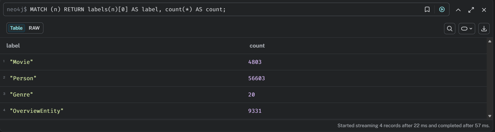
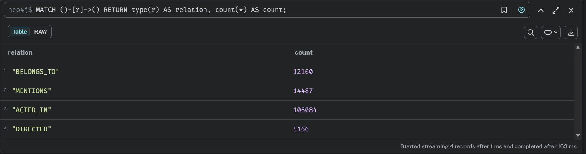
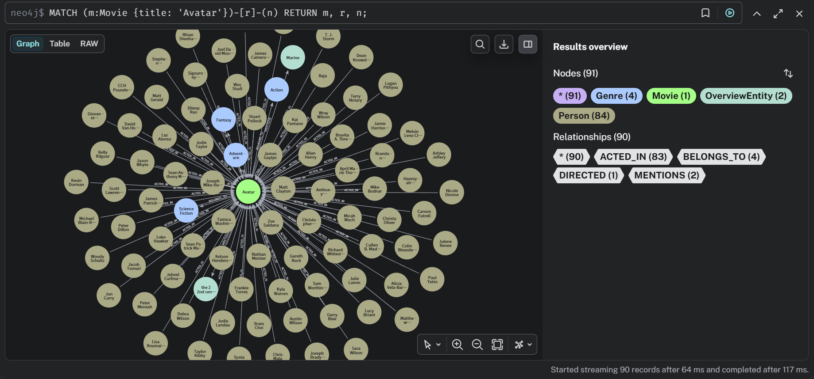
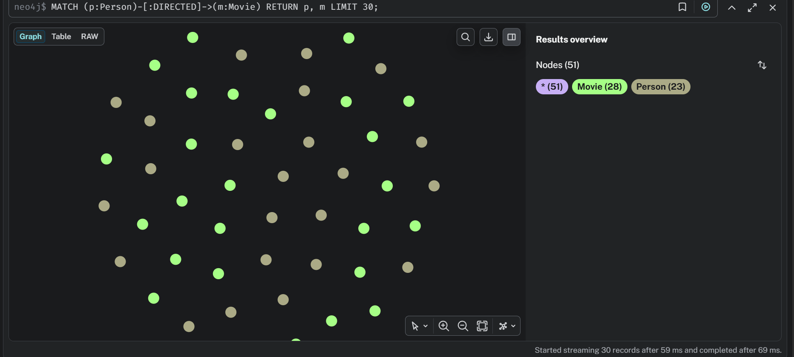
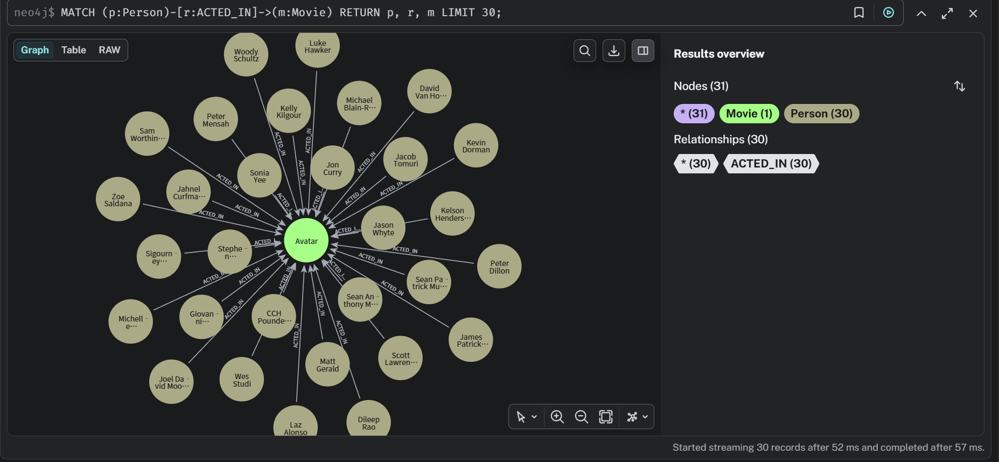
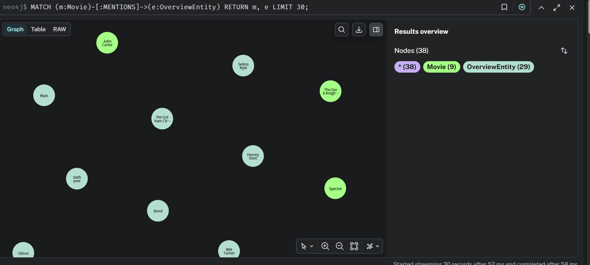
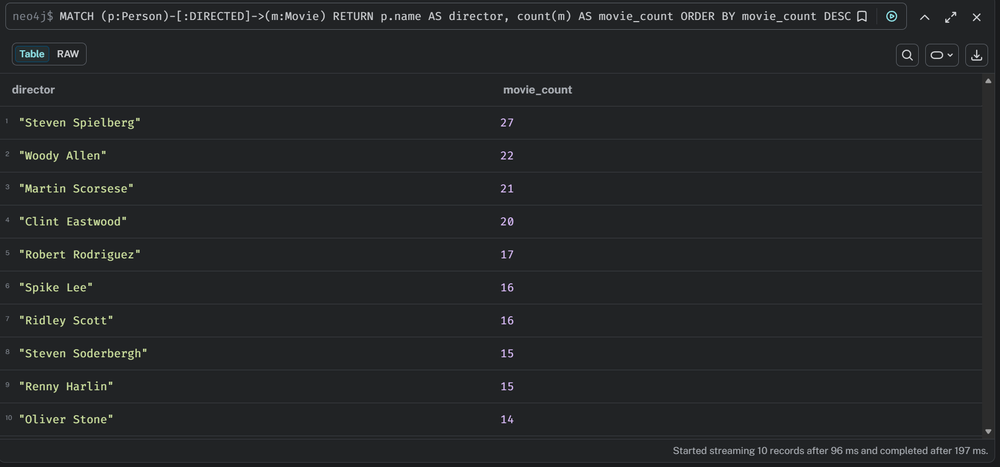
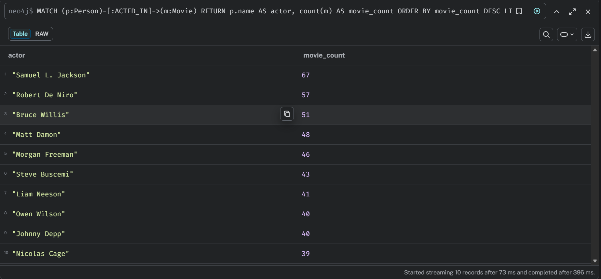

# 大数据课程实验报告

## 实验名称

构建小型领域知识图谱: 基于 TMDB 电影数据集的电影知识图谱设计与实现

## 一、实验目的

本实验的目标是完成一个小型领域知识图谱的构建流程，掌握从原始数据到图数据库落地的基本方法。具体包括以下几个方面:

1. 学习知识图谱中的基本概念，包括实体、关系、属性和图模式设计。
2. 学习如何从结构化数据中提取实体和关系，并转换为适合图数据库存储的形式。
3. 学习使用 NLP 工具对非结构化文本进行实体识别，理解自然语言处理在知识图谱构建中的作用。
4. 学习使用 Neo4j 对知识图谱进行导入、查询和可视化分析。
5. 能够独立完成一个小型知识图谱项目的设计、实现和实验总结。

## 二、实验环境

- 操作系统: Windows
- 开发工具: VS Code
- 编程语言: Python 3.12.4
- 主要库: pandas, spaCy
- NLP 模型: `en_core_web_sm`
- 图数据库: Neo4j Desktop 2, Neo4j 2026.02.2

## 三、数据来源与数据说明

### 3.1 数据来源

本实验选用 Kaggle 上的 `TMDB 5000 Movie Dataset` 作为数据源。该数据集包含电影元信息和演职员信息，适合用于构建电影知识图谱。

参考来源:

- https://www.kaggle.com/datasets/tmdb/tmdb-movie-metadata

### 3.2 使用的数据文件

实验中主要使用了两个 CSV 文件:

1. `tmdb_5000_movies.csv`
2. `tmdb_5000_credits.csv`

其中:

- `tmdb_5000_movies.csv` 主要提供电影基础信息、电影简介、类型等字段。
- `tmdb_5000_credits.csv` 主要提供演员列表和剧组成员信息。

### 3.3 主要字段说明

本实验实际使用的字段如下:

- `id`: 电影唯一标识
- `title`: 电影标题
- `original_title`: 原始标题
- `overview`: 电影简介
- `release_date`: 上映日期
- `vote_average`: 平均评分
- `vote_count`: 评分人数
- `popularity`: 热度
- `genres`: 电影类型
- `cast`: 演员信息
- `crew`: 剧组成员信息

## 四、知识图谱设计

### 4.1 图谱模式设计

考虑到课程作业要求、数据可用性以及实现复杂度，本实验在第一版中设计了 4 类节点和 4 类关系。

#### 节点类型

1. `Movie`
2. `Person`
3. `Genre`
4. `OverviewEntity`

其中:

- `Movie` 表示电影实体。
- `Person` 表示人物实体，主要包括演员和导演。
- `Genre` 表示电影类型实体。
- `OverviewEntity` 表示从电影简介文本中通过 NLP 识别出的实体。

#### 关系类型

1. `(:Person)-[:ACTED_IN]->(:Movie)`
2. `(:Person)-[:DIRECTED]->(:Movie)`
3. `(:Movie)-[:BELONGS_TO]->(:Genre)`
4. `(:Movie)-[:MENTIONS]->(:OverviewEntity)`

### 4.2 实体属性设计

`Movie` 节点包含以下主要属性:

- `movie_id`
- `title`
- `original_title`
- `overview`
- `release_date`
- `vote_average`
- `vote_count`
- `popularity`

`Person` 节点包含:

- `person_id`
- `name`

`Genre` 节点包含:

- `genre_id`
- `name`

`OverviewEntity` 节点包含:

- `entity_id`
- `name`
- `label`

### 4.3 关系属性设计

在本实验中，`ACTED_IN` 关系带有以下属性:

- `character`: 演员在电影中的角色名称
- `cast_order`: 演员在演员表中的顺序

之所以将这两个字段放在关系上，而不是放在节点上，是因为它们描述的是“某个演员在某部电影中的具体出演情况”，属于边的属性，而不属于演员或电影单独的属性。

例如，同一个演员在不同电影中会扮演不同角色，因此 `character` 应属于 `ACTED_IN` 关系。

## 五、实验方法与实现过程

### 5.1 数据预处理

原始数据集中部分字段并不是标准表格列，而是 JSON 风格的字符串，例如:

- `genres`
- `cast`
- `crew`

因此在 Python 预处理阶段，我先使用 `pandas` 读取 CSV，再使用 `ast.literal_eval` 将这些字符串解析为 Python 列表或字典，然后分别构建节点表和关系表。

预处理的核心过程如下:

1. 从 `movies.csv` 中提取电影节点。
2. 从 `genres` 字段中提取类型节点以及 `BELONGS_TO` 关系。
3. 从 `credits.csv` 中的 `cast` 字段提取人物节点以及 `ACTED_IN` 关系。
4. 从 `crew` 字段中筛选 `job = Director` 的记录，构建 `DIRECTED` 关系。
5. 输出为多个中间 CSV 文件，供 Neo4j 导入。

最终得到的中间文件包括:

- `movie_nodes.csv`
- `person_nodes.csv`
- `genre_nodes.csv`
- `acted_in_edges.csv`
- `directed_edges.csv`
- `movie_genre_edges.csv`

### 5.2 NLP 实体抽取

课程要求中明确提出要使用 NLP 工具提取实体和关系。考虑到该数据集本身已经提供了大量结构化字段，因此本实验采用“结构化数据构建主图谱，NLP 处理非结构化文本”的方式完成任务。

具体来说，我使用 spaCy 的英文模型 `en_core_web_sm` 对 `overview` 字段进行命名实体识别。保留的实体类别包括:

- `PERSON`
- `ORG`
- `GPE`
- `LOC`
- `DATE`

实体抽取完成后，构建:

- `OverviewEntity` 节点
- `(:Movie)-[:MENTIONS]->(:OverviewEntity)` 关系

这种方式的优点是:

1. 主图谱结构稳定，不依赖复杂文本关系抽取。
2. 能体现对非结构化文本的处理能力。
3. 便于在报告中说明“结构化数据解析”和“NLP 抽取”的不同作用。

### 5.3 Neo4j 导入

在完成预处理后，我将生成的 CSV 文件复制到 Neo4j 数据库的 `import` 目录下，并使用 `LOAD CSV WITH HEADERS` 语句将数据导入图数据库。

导入流程包括:

1. 创建唯一约束，防止重复节点。
2. 导入 `Movie`、`Person`、`Genre`、`OverviewEntity` 节点。
3. 导入 `BELONGS_TO`、`ACTED_IN`、`DIRECTED`、`MENTIONS` 关系。

## 六、实验结果

### 6.1 节点数量统计

下图展示了图谱中各类节点的统计结果。

从结果可以看出:

- `Movie` 节点数为 4803
- `Person` 节点数为 56603
- `Genre` 节点数为 20
- `OverviewEntity` 节点数为 9331

这说明本实验已经成功从原始数据和电影简介文本中提取出了较为丰富的实体信息。

### 6.2 关系数量统计

下图展示了图谱中各类关系的统计结果。

从结果可以看出:

- `BELONGS_TO` 关系数为 12160
- `MENTIONS` 关系数为 14487
- `ACTED_IN` 关系数为 106084
- `DIRECTED` 关系数为 5166

其中 `ACTED_IN` 的数量最多，说明演员与电影之间的联系在该图谱中最为丰富。

### 6.3 局部图谱可视化: Avatar

为了验证图谱结构是否合理，我以电影 `Avatar` 为例进行了局部可视化。

从图中可以看到:

- `Avatar` 与多位演员之间存在 `ACTED_IN` 关系
- `Avatar` 与多个类型节点之间存在 `BELONGS_TO` 关系
- `Avatar` 与从 `overview` 中抽取的文本实体之间存在 `MENTIONS` 关系
- `Avatar` 与导演之间存在 `DIRECTED` 关系

这说明知识图谱的设计是有效的，不同来源的数据被统一组织到了同一张图中。

### 6.4 导演关系可视化

下图展示了导演与电影之间的 `DIRECTED` 关系。

该结果表明，我成功从 `crew` 字段中筛选出导演信息，并建立了人物与电影之间的导演关系。

### 6.5 演员关系可视化

下图展示了演员与电影之间的 `ACTED_IN` 关系。

该结果表明，知识图谱不仅保留了演员与电影之间的连接，还支持后续进一步分析演员出演频次、角色信息等内容。

### 6.6 NLP 抽取结果可视化

下图展示了电影与简介文本实体之间的 `MENTIONS` 关系。

可以看出，spaCy 从电影简介中抽取出了部分人物、地点、日期、组织等实体。这部分信息并不是原始结构化字段直接提供的，而是通过自然语言处理得到的，因此体现了 NLP 在知识图谱补充中的价值。

### 6.7 统计分析结果

为了进一步验证图谱的分析能力，我统计了导演执导电影数量排名前十的结果。

从结果中可以看到，Steven Spielberg、Woody Allen、Martin Scorsese 等导演在当前数据集中执导的电影数量较多。

同时，我统计了演员参演电影数量排名前十的结果。

结果显示 Samuel L. Jackson、Robert De Niro、Bruce Willis 等演员在数据集中出现频率较高。该结果说明构建出的图谱已经不仅能进行可视化展示，还能够支持简单的数据分析。

## 七、实验分析

### 7.1 本实验的优点

本实验的实现思路较为清晰，优点主要体现在以下几个方面:

1. 数据来源可靠，字段语义明确，适合课程实验。
2. 图谱模式设计简洁，能够突出电影领域中的核心实体和核心关系。
3. 同时结合了结构化数据处理与 NLP 文本处理，满足了课程对知识图谱构建流程的要求。
4. 使用 Neo4j 完成可视化后，图谱结果直观，适合展示和分析。

### 7.2 存在的问题

虽然实验整体达到了预期目标，但仍存在一些不足:

1. `overview` 中的实体识别依赖通用英文模型，对电影语境下的专有名词识别并不总是准确。
2. 当前 NLP 部分主要完成了实体抽取，尚未对文本中的复杂关系进行深入抽取。
3. 人物节点中同时包含演员和导演，没有进一步细分为不同角色类型。
4. 图谱规模已经较大，如果进一步增加关键词、制片公司、国家、语言等实体，导入和可视化复杂度会明显上升。

### 7.3 可改进方向

后续可以从以下方向继续优化:

1. 增加 `Keyword`、`Company`、`Country` 等实体类型。
2. 将 `Writer`、`Producer` 等剧组角色也纳入图谱。
3. 尝试使用更强的 NLP 模型或基于规则的方法进行关系抽取。
4. 对文本实体进行清洗和去噪，提高 `OverviewEntity` 的质量。
5. 设计更丰富的 Cypher 查询，实现推荐、关联分析等功能。

## 八、实验结论

本实验基于 TMDB 5000 Movie Dataset，完成了一个小型电影领域知识图谱的构建。实验中首先对结构化数据进行了清洗与解析，提取出电影、人物、类型等实体以及出演、导演、类型归属等关系；随后利用 spaCy 对电影简介文本进行了命名实体识别，将非结构化文本中的实体补充到图谱中；最后使用 Neo4j 完成了数据导入、可视化展示和简单统计分析。

通过本实验，我掌握了知识图谱构建中的几个关键环节: 数据选择、模式设计、实体关系抽取、NLP 文本处理、Neo4j 导入与查询。整体来看，本实验较好地完成了课程要求，也为后续进一步研究更复杂的知识图谱构建方法打下了基础。

## 九、附录: 关键实现文件

项目中的核心实现文件包括:

- `src/preprocess.py`
- `src/extract_overview_entities.py`
- `src/neo4j_import.cypher`

这些文件分别完成了数据预处理、NLP 实体抽取和 Neo4j 导入工作。
