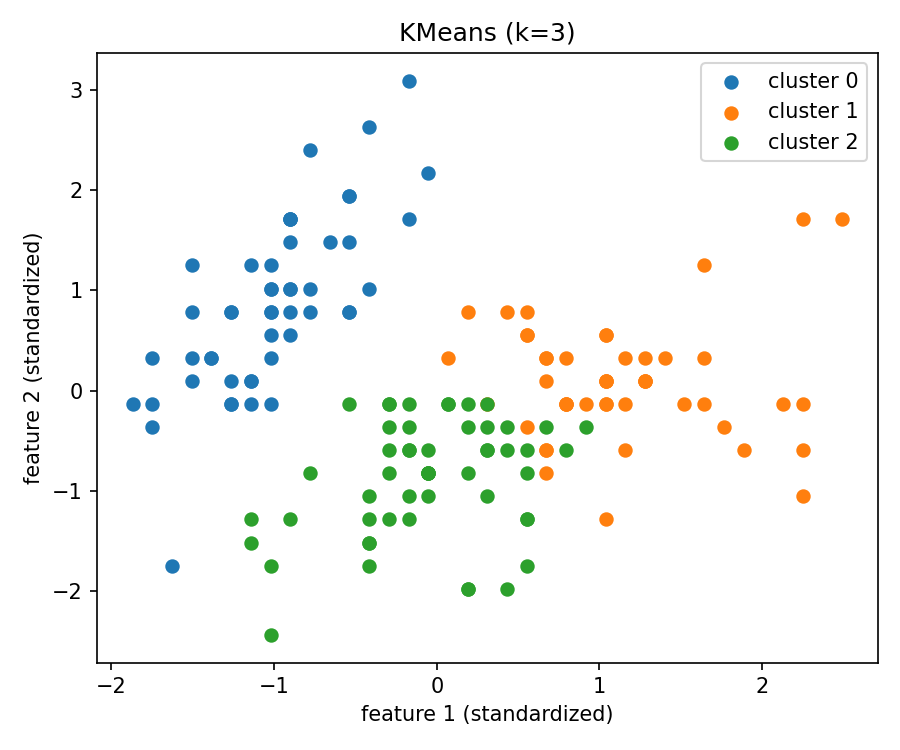
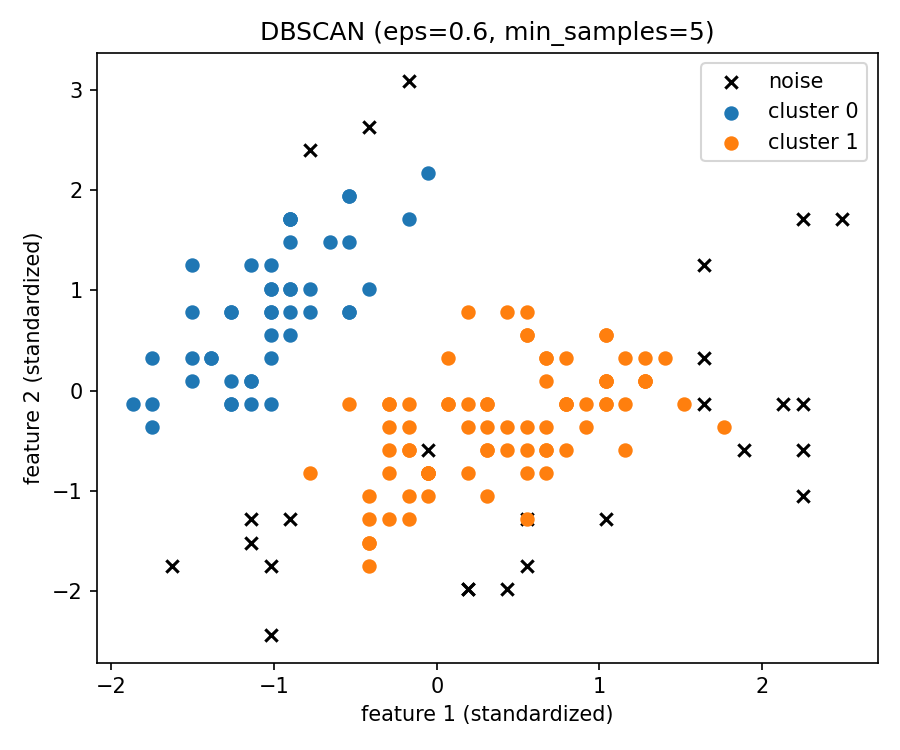

# 大数据课程作业3实验报告

## 实验名称

聚类算法对比实验：K-means 与 DBSCAN 在 Iris 数据集上的实现与分析

## 一、实验目的

本实验旨在完成两个经典聚类算法（K-means、DBSCAN）的核心逻辑实现，并在标准数据集上进行对比分析。通过本实验，我希望掌握：

1. 无监督学习中“基于中心”的聚类思想与“基于密度”的聚类思想差异。
2. K-means 与 DBSCAN 的算法流程、参数含义及适用场景。
3. 聚类任务中常见评估指标（准确率、轮廓系数、Calinski-Harabasz 指数）的含义与使用方式。
4. 参数变化对聚类结果（簇数、噪声点、指标表现）的影响规律。

## 二、实验环境

- 操作系统：Windows
- 开发工具：VS Code
- 编程语言：Python 3.12
- 主要依赖：NumPy、SciPy、scikit-learn、Matplotlib

## 三、实验数据

本实验使用 Iris（鸢尾花）数据集：

- 样本数：150
- 特征数：4（花萼长度、花萼宽度、花瓣长度、花瓣宽度）
- 类别数：3（Setosa、Versicolor、Virginica）

说明：

- 聚类本质是无监督任务，不直接使用标签训练。
- 为了对比结果，实验中将真实标签仅用于离线评估 accuracy。
- 数据在聚类前进行了标准化（StandardScaler），避免特征量纲影响距离计算。

## 四、算法实现

### 4.1 K-means 核心实现

本实验未调用 `sklearn.cluster.KMeans` 完整接口，而是自行实现核心步骤：

1. 初始化聚类中心（k-means++）  
2. 计算每个样本到各中心距离，并分配到最近中心  
3. 以簇内样本均值更新中心  
4. 重复迭代，直到中心移动量小于阈值 `tol` 或达到最大迭代次数  
5. 处理空簇：若某簇无样本，随机重置该簇中心

### 4.2 DBSCAN 核心实现

本实验未调用 `sklearn.cluster.DBSCAN` 完整接口，而是自行实现：

1. 计算样本 `eps` 邻域内邻居集合  
2. 邻居数不少于 `min_samples` 的点定义为核心点  
3. 从核心点出发，递归扩展密度可达点形成簇  
4. 未被任何簇吸收的点标记为噪声（标签 `-1`）

### 4.3 评估指标实现

实验使用三类指标：

1. **Accuracy（聚类准确率）**：  
   使用匈牙利算法（Hungarian）进行“聚类标签 → 真实标签”的最优匹配后计算准确率。  
2. **Silhouette Coefficient（轮廓系数）**：  
   衡量类内紧凑与类间分离程度，越高越好。  
3. **Calinski-Harabasz 指数（CH）**：  
   衡量类间离散与类内离散比值，越高越好。

说明：DBSCAN 的噪声点（`-1`）在轮廓系数与 CH 计算中被排除，以避免评价失真。

## 五、实验过程与结果

### 5.1 单次基准实验结果

基准参数：

- K-means：`k=3`
- DBSCAN：`eps=0.6, min_samples=5`

得到结果（终端输出）：

- K-means：  
  - accuracy = 0.8333  
  - silhouette = 0.4599  
  - CH = 241.9044  
  - n_clusters = 3  
  - n_noise = 0  

- DBSCAN：  
  - accuracy = 0.7097  
  - silhouette = 0.6419  
  - CH = 330.9165  
  - n_clusters = 2  
  - n_noise = 26  

可视化输出文件：

- `output/kmeans_scatter.png`
- `output/dbscan_scatter.png`

图 1：K-means 聚类可视化（`k=3`）



图 2：DBSCAN 聚类可视化（`eps=0.6, min_samples=5`）



### 5.2 K-means 参数扫描结果（k）

| k | accuracy | silhouette | CH | n_clusters |
|---|---:|---:|---:|---:|
| 2 | 0.6667 | 0.5818 | 251.3493 | 2 |
| 3 | 0.8333 | 0.4599 | 241.9044 | 3 |
| 4 | 0.7133 | 0.3776 | 176.3340 | 4 |
| 5 | 0.5467 | 0.3046 | 172.7859 | 5 |

分析：

- `k=3` 的 accuracy 最高，与 Iris 三类别结构一致。
- `k=2` 的 silhouette 与 CH 更高，说明其几何分离更明显，但会把真实三类压成两团，类别语义损失。
- 当 `k` 继续增大到 4、5，出现过分切分，accuracy 与几何指标均下降。

### 5.3 DBSCAN 参数扫描结果（eps, min_samples）

完整结果见 `output/dbscan_sweep.csv`，主要结论如下：

1. `eps` 较小且 `min_samples` 较大时，核心点条件严格，噪声点显著增加。  
   例如 `eps=0.4,min_samples=8` 时，噪声点达到 117。

2. `eps` 增大后，噪声点减少，但簇数可能下降到 2（欠分）。  
   例如 `eps=0.7,min_samples=3` 时，噪声点仅 5，但仅得到 2 个簇。

3. `eps=0.5,min_samples=8` 时：
   - accuracy = 0.9670（最高）
   - n_clusters = 3（与真实类别数一致）
   - n_noise = 59（仍偏高）

这说明该参数组合在“标签对齐”上表现最好，但噪声判定较严格。

### 5.4 CSV 结果摘录

K-means 扫描结果（`output/kmeans_sweep.csv`）：

```csv
k,accuracy,silhouette,calinski_harabasz,n_clusters,n_noise
2,0.6666666666666666,0.5817500491982808,251.34933946458108,2,0
3,0.8333333333333334,0.45994823920518635,241.90440170183157,3,0
4,0.7133333333333334,0.37758008728222414,176.33401923013992,4,0
5,0.5466666666666666,0.3045805027295187,172.78587761662655,5,0
```

DBSCAN 扫描结果（`output/dbscan_sweep.csv`，节选）：

```csv
eps,min_samples,accuracy,silhouette,calinski_harabasz,n_clusters,n_noise
0.5,5,0.7241379310344828,0.6558885287002016,343.9680845935908,2,34
0.5,8,0.967032967032967,0.6028694923383574,280.83535287626614,3,59
0.6,5,0.7096774193548387,0.6418946941661956,330.9165416576153,2,26
0.7,3,0.6827586206896552,0.600152434408338,280.36792482752907,2,5
```

### 5.5 实验过程中的核心代码片段

#### 5.5.1 K-means：初始化、分配、更新与收敛

```python
# k-means++ 初始化中心
for i in range(1, self.n_clusters):
    d2 = np.min(((x[:, None, :] - centroids[None, :i, :]) ** 2).sum(axis=2), axis=1)
    probs = d2 / d2.sum()
    next_idx = rng.choice(n_samples, p=probs)
    centroids[i] = x[next_idx]

# 分配标签 + 更新中心
labels = self._assign_labels(x, centroids)
for k in range(self.n_clusters):
    members = x[labels == k]
    if len(members) == 0:
        new_centroids[k] = x[rng.integers(0, x.shape[0])]
    else:
        new_centroids[k] = members.mean(axis=0)

# 收敛判定
shift = np.sqrt(((new_centroids - centroids) ** 2).sum(axis=1)).max()
if shift <= self.tol:
    break
```

#### 5.5.2 DBSCAN：邻域查询与密度扩展

```python
def _region_query(self, x: np.ndarray, idx: int) -> np.ndarray:
    distances = np.sqrt(((x - x[idx]) ** 2).sum(axis=1))
    return np.where(distances <= self.eps)[0]

neighbors = self._region_query(x, i)
if len(neighbors) < self.min_samples:
    labels[i] = -1  # 噪声点
else:
    labels[i] = cluster_id
    seeds = list(neighbors)
    # 递归/迭代扩展密度可达点
```

#### 5.5.3 评估：匈牙利匹配准确率

```python
cost = np.zeros((len(true_labels), len(pred_labels)), dtype=int)
for i, t in enumerate(true_labels):
    for j, p in enumerate(pred_labels):
        cost[i, j] = np.sum((y_true == t) & (y_pred == p))

row_ind, col_ind = linear_sum_assignment(cost.max() - cost)
correct = cost[row_ind, col_ind].sum()
acc = correct / len(y_true)
```

## 六、对比分析

### 6.1 算法机制差异

- K-means：通过“中心 + 最短距离”划分样本，适合近似球形簇，需预设簇数 `k`。
- DBSCAN：通过“密度连通”形成簇，不需要预设簇数，可识别噪声点，适合存在离群点的数据。

### 6.2 指标层面差异

- K-means（`k=3`）在 accuracy 上稳定且可解释性强。
- DBSCAN 在不同参数下波动较大，体现出高参数敏感性。
- 几何指标（silhouette/CH）与 accuracy 不总一致，原因是前者不依赖真实标签，后者依赖标签映射。

### 6.3 本实验最终推荐参数

- K-means：`k=3`
- DBSCAN：`eps=0.5, min_samples=8`

推荐理由：

- K-means 在已知簇数任务下表现稳定；
- DBSCAN 在该参数下获得最高 accuracy 且得到 3 个簇，但噪声点较多，体现密度法的“严格聚类”特性。

## 七、结论

本实验完成了 K-means 与 DBSCAN 的核心逻辑实现，并在 Iris 数据集上进行了系统参数对比。实验表明：

1. K-means 在类别数已知时表现稳定，`k=3` 可较好恢复真实类别结构。  
2. DBSCAN 能识别噪声点，不需预设簇数，但对 `eps/min_samples` 高度敏感。  
3. 聚类评价应结合多指标：accuracy 反映标签对齐，silhouette 与 CH 反映几何结构质量。  
4. 无监督任务中，算法选择与参数设置应与具体数据分布特征共同决定。

## 八、附录：主要代码文件

- `src/kmeans.py`
- `src/dbscan.py`
- `src/metrics_custom.py`
- `src/main.py`
- `src/sweep.py`
