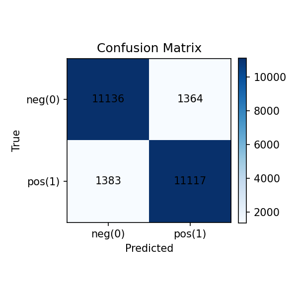
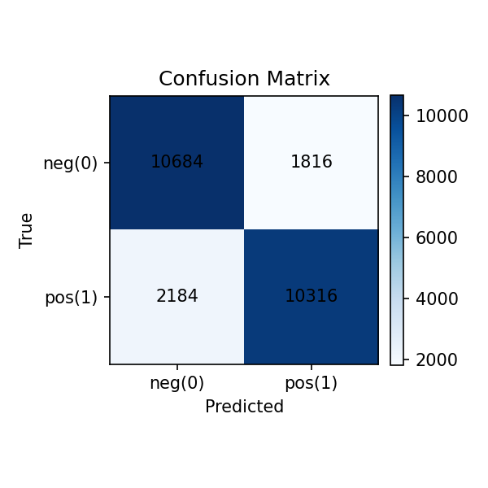
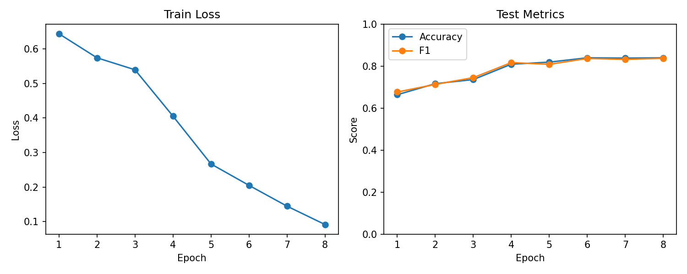

# 大数据课程作业四实验报告

## 实验名称

IMDB 电影评论情感分类实验：TF-IDF + Logistic Regression、TF-IDF + LinearSVC 与 Embedding + LSTM 对比分析


## 一、实验目的

本实验基于 IMDB 电影评论数据集，完成一个二分类情感分析任务，并对不同文本表示方式与分类模型的效果进行对比分析。具体目标如下：

1. 掌握文本分类任务的基本流程，包括数据加载、文本预处理、特征构建、模型训练与结果评估。
2. 理解传统机器学习方法与神经网络方法在文本情感分类任务中的差异。
3. 比较 `TF-IDF + Logistic Regression`、`TF-IDF + LinearSVC`、`Embedding + LSTM` 三种方案在同一数据集上的性能表现。
4. 结合混淆矩阵与训练曲线，对模型的优势、局限和误差来源进行分析。

## 二、实验环境

- 操作系统：Windows
- 编程语言：Python
- 主要依赖库：`datasets`、`scikit-learn`、`matplotlib`、`torch`
- 数据集来源：Hugging Face `imdb`
- 实验项目目录：`D:\SYSU_Bigdata_Assignments\task4`

## 三、数据集与任务说明

本实验使用 Hugging Face 提供的 IMDB 影评数据集。该数据集常用于英文情感分类任务，标签为二分类：

- `0`：negative，负面评论
- `1`：positive，正面评论

数据集划分如下：

| 数据集划分 | 样本数 |
| --- | ---: |
| 训练集 | 25000 |
| 测试集 | 25000 |
| 总计 | 50000 |

在代码实现中，数据通过 `datasets.load_dataset("imdb")` 直接加载，随后统一进行小写化和首尾空白清理，以保证不同模型使用相同的数据来源与相同的训练/测试划分，从而提升实验对比的公平性。

## 四、实验方法与实现过程

### 4.1 整体流程

本实验的整体流程如下：

1. 读取 IMDB 训练集与测试集文本及标签。
2. 对文本进行基础预处理，仅做小写化与去除多余空白。
3. 分别构建三种模型：
   - 基于稀疏文本统计特征的 `TF-IDF + Logistic Regression`
   - 基于稀疏文本统计特征的 `TF-IDF + LinearSVC`
   - 基于词表与序列建模的 `Embedding + LSTM`
4. 在测试集上计算准确率、精确率、召回率、F1-score，并绘制混淆矩阵。
5. 对 LSTM 额外记录各轮训练损失、测试集准确率和 F1-score 变化趋势。

### 4.2 数据预处理

数据加载模块位于 `src/data.py`。核心处理逻辑较为轻量，主要包括：

1. 直接读取 IMDB 原始训练集和测试集。
2. 对所有文本执行 `lower().strip()`。
3. 不进行停用词删除、词干提取或复杂清洗，尽量保持实验实现简洁。

这种处理方式的优点是实现简单、可复现性强；缺点是没有针对文本噪声做进一步优化，因此结果主要由特征表示与模型能力决定。

### 4.3 方法一：TF-IDF + Logistic Regression

该方法首先通过 `TfidfVectorizer` 将文本转换为稀疏特征向量，再使用逻辑回归进行二分类。其实现脚本为 `train_tfidf_lr.py`。

主要设置如下：

| 参数 | 取值 |
| --- | --- |
| 特征提取方式 | TF-IDF |
| `max_features` | 20000 |
| `ngram_range` | `(1, 2)` |
| 分类器 | Logistic Regression |
| 求解器 | `saga` |
| `max_iter` | 1000 |
| `random_state` | 42 |

其中，TF-IDF 同时使用 unigram 和 bigram，这意味着模型不仅能利用单个词，还能利用类似 “very good”“not bad” 这样的局部短语信息，对情感分类较为有效。

核心代码思路如下：

```python
x_train, x_test, _ = build_tfidf_features(
    train_texts=train_texts,
    test_texts=test_texts,
    max_features=20000,
)

model = LogisticRegression(
    solver="saga",
    max_iter=1000,
    random_state=42,
)
model.fit(x_train, train_labels)
```

### 4.4 方法二：TF-IDF + LinearSVC

该方法与上一方法使用完全相同的文本特征，仅将分类器替换为线性支持向量机，以便对比不同线性分类器在相同特征空间上的表现。实现脚本为 `train_tfidf_svm.py`。

主要设置如下：

| 参数 | 取值 |
| --- | --- |
| 特征提取方式 | TF-IDF |
| `max_features` | 20000 |
| `ngram_range` | `(1, 2)` |
| 分类器 | LinearSVC |
| `max_iter` | 3000 |
| `random_state` | 42 |

核心代码如下：

```python
x_train, x_test, _ = build_tfidf_features(
    train_texts=train_texts,
    test_texts=test_texts,
    max_features=20000,
)

model = LinearSVC(max_iter=3000, random_state=42)
model.fit(x_train, train_labels)
```

### 4.5 方法三：Embedding + LSTM

第三种方法不再使用 TF-IDF，而是将文本视为词序列，先建立词表，再将每条评论编码为固定长度的 token id 序列，输入到 `Embedding + LSTM + Linear` 结构中完成分类。实现脚本为 `train_rnn.py`。

主要步骤如下：

1. 对训练集分词并统计词频。
2. 构建最大词表大小为 30000 的词典。
3. 将文本编码为长度上限为 256 的序列，超长截断，不足补零。
4. 使用嵌入层将 token id 映射到稠密向量。
5. 使用单层 LSTM 建模序列上下文，取最后有效时间步的输出进行二分类。

模型与训练配置如下：

| 参数 | 取值 |
| --- | --- |
| 最大序列长度 | 256 |
| 最大词表大小 | 30000 |
| 词向量维度 | 128 |
| LSTM 隐状态维度 | 128 |
| Batch Size | 64 |
| Epochs | 8 |
| 学习率 | 0.001 |
| 优化器 | Adam |
| 损失函数 | BCEWithLogitsLoss |
| 运行设备 | CUDA |

核心代码如下：

```python
model = LSTMClassifier(
    vocab_size=len(vocab),
    embedding_dim=128,
    hidden_dim=128,
).to(device)

criterion = nn.BCEWithLogitsLoss()
optimizer = torch.optim.Adam(model.parameters(), lr=1e-3)
```

与前两种方法相比，LSTM 理论上能够利用词序信息，但同时也更依赖足够充分的训练、合理的序列长度和更稳定的超参数设置。

### 4.6 评估指标

本实验统一使用以下指标评估三种模型：

- Accuracy：整体分类正确率
- Precision：预测为正样本中真正为正的比例
- Recall：真实正样本中被识别出来的比例
- F1-score：Precision 与 Recall 的调和平均
- Confusion Matrix：展示不同类别的分类分布

混淆矩阵定义为：

| 真实类别 \\ 预测类别 | 预测为负类 0 | 预测为正类 1 |
| --- | ---: | ---: |
| 真实为负类 0 | TN | FP |
| 真实为正类 1 | FN | TP |

## 五、实验结果

### 5.1 三种模型总体性能对比

根据 `outputs/metrics` 中保存的实验结果，可得到三种方法在测试集上的性能如下：

| 模型 | Accuracy | Precision | Recall | F1-score |
| --- | ---: | ---: | ---: | ---: |
| TF-IDF + Logistic Regression | 0.8953 | 0.8922 | 0.8994 | 0.8957 |
| TF-IDF + LinearSVC | 0.8901 | 0.8907 | 0.8894 | 0.8900 |
| Embedding + LSTM | 0.8400 | 0.8503 | 0.8253 | 0.8376 |

从结果可以看出：

1. `TF-IDF + Logistic Regression` 在本实验中取得了最佳整体表现。
2. `TF-IDF + LinearSVC` 与逻辑回归非常接近，但略低于逻辑回归。
3. `Embedding + LSTM` 明显低于前两种传统文本分类基线。

若按准确率排序，可得到：

| 排名 | 模型 | Accuracy |
| --- | --- | ---: |
| 1 | TF-IDF + Logistic Regression | 0.8953 |
| 2 | TF-IDF + LinearSVC | 0.8901 |
| 3 | Embedding + LSTM | 0.8400 |

### 5.2 混淆矩阵数据对比

各模型的混淆矩阵如下：

| 模型 | TN | FP | FN | TP |
| --- | ---: | ---: | ---: | ---: |
| TF-IDF + Logistic Regression | 11141 | 1359 | 1258 | 11242 |
| TF-IDF + LinearSVC | 11136 | 1364 | 1383 | 11117 |
| Embedding + LSTM | 10684 | 1816 | 2184 | 10316 |

从混淆矩阵可以看出，LSTM 的 `FN` 和 `FP` 都显著高于前两种 TF-IDF 方法，尤其是对正样本的漏判更多，说明该模型当前配置下对情感信号的捕捉仍不充分。

### 5.3 LSTM 训练过程记录

LSTM 在 8 个 epoch 中的训练损失与测试集指标如下：

| Epoch | Train Loss | Test Accuracy | Test F1-score |
| --- | ---: | ---: | ---: |
| 1 | 0.6438 | 0.6640 | 0.6769 |
| 2 | 0.5742 | 0.7167 | 0.7133 |
| 3 | 0.5395 | 0.7363 | 0.7454 |
| 4 | 0.4053 | 0.8094 | 0.8171 |
| 5 | 0.2669 | 0.8194 | 0.8090 |
| 6 | 0.2049 | 0.8400 | 0.8369 |
| 7 | 0.1447 | 0.8386 | 0.8326 |
| 8 | 0.0916 | 0.8400 | 0.8376 |

该结果说明：

1. 模型在前 4 个 epoch 提升较快。
2. 第 6 个 epoch 后测试集性能基本趋于稳定。
3. 尽管训练损失持续下降，但测试集指标提升有限，说明模型开始逐步接近泛化瓶颈。

### 5.4 结果图像展示

#### 5.4.1 三种模型混淆矩阵对比

<table>
  <tr>
    <td align="center">
      <br>
      <strong>图 1.</strong> TF-IDF + Logistic Regression
    </td>
    <td align="center">
      <br>
      <strong>图 2.</strong> TF-IDF + LinearSVC
    </td>
    <td align="center">
      <br>
      <strong>图 3.</strong> Embedding + LSTM
    </td>
  </tr>
</table>

从并排展示的混淆矩阵可以更直观地看出，逻辑回归与 LinearSVC 的矩阵结构非常接近，而 LSTM 的非对角线区域更明显，说明误分类样本更多。

其中：

- 图 1 中逻辑回归在正负两类上的分类较为均衡，误判数量较少。
- 图 2 中 LinearSVC 与逻辑回归表现接近，说明两者在高维稀疏 TF-IDF 空间中具有相似判别能力。
- 图 3 中 LSTM 的正类漏判和负类误判均更突出，说明当前模型配置下对情感模式的捕捉仍不如 TF-IDF 基线稳定。

#### 5.4.2 LSTM 训练曲线

<p align="center">
  
</p>

<p align="center"><strong>图 4.</strong> LSTM 训练损失与测试集指标变化曲线</p>

训练曲线显示，随着训练轮数增加，训练损失持续下降，但测试集指标并未同步大幅提升，说明该模型在当前结构与参数下虽能学习到有效模式，但其最终性能仍受限。

## 六、结果分析

### 6.1 为什么 TF-IDF 方法反而优于 LSTM

从直观印象看，LSTM 属于深度学习模型，理论表达能力更强，但本实验中其结果却落后于 TF-IDF 基线。这一现象并不反常，原因主要包括以下几点：

1. **任务本身较适合词频统计特征**

   IMDB 情感分类中，大量高区分度词或短语本身就能直接反映情感倾向，例如褒义词、贬义词以及否定结构。TF-IDF 尤其在加入 bigram 后，能够高效捕捉这些局部模式，因此在线性分类器上就能取得很强的效果。

2. **当前 LSTM 结构较轻量**

   本实验中的 LSTM 为单层结构，隐藏维度为 128，且没有使用双向 LSTM、注意力机制或预训练词向量。对于 IMDB 这类较长文本，这样的模型容量是有限的。

3. **分词方式较简单**

   代码中分词方式仅为 `text.split()`，这会导致标点、缩写、特殊符号等处理不够精细，也没有进行更适合英文语料的标准化操作。相比之下，TF-IDF 依赖 `TfidfVectorizer` 内置的文本处理能力，更容易得到稳定特征。

4. **序列截断会丢失部分后文信息**

   每条评论最大长度设置为 256，超出部分被直接截断。对于较长影评，后半部分往往包含总结性情感表达，截断会造成信息损失。

5. **未使用验证集进行超参数调优**

   当前实现中直接在固定参数下训练 8 个 epoch，没有单独设置验证集来选择最优模型和训练轮数，也没有进行正则化、dropout 或更细致的学习率调度，这会限制 LSTM 的最终效果。

因此，本实验的结果恰好说明：在中小规模文本分类任务中，强基线模型并不一定比轻量级神经网络差，尤其是在特征工程与任务性质高度匹配时，传统方法仍然非常有竞争力。

### 6.2 Logistic Regression 与 LinearSVC 的对比

在使用相同 TF-IDF 特征的前提下，逻辑回归和线性 SVM 的性能非常接近，但逻辑回归略优。这说明：

1. 两者都很适合处理高维稀疏文本特征。
2. 当前数据和参数下，逻辑回归对决策边界的拟合略好于 LinearSVC。
3. 两者差距不大，说明性能提升的关键主要来自文本表示方式，而不是分类器名称本身。

具体来看：

| 模型 | Accuracy | Precision | Recall | F1-score |
| --- | ---: | ---: | ---: | ---: |
| TF-IDF + Logistic Regression | 0.8953 | 0.8922 | 0.8994 | 0.8957 |
| TF-IDF + LinearSVC | 0.8901 | 0.8907 | 0.8894 | 0.8900 |
| 差值（LR - SVM） | 0.0052 | 0.0014 | 0.0100 | 0.0057 |

其中，逻辑回归在 Recall 上的优势更明显，说明它对正样本识别得更充分一些。

### 6.3 从混淆矩阵看模型误差特点

1. **Logistic Regression**

   该模型的 `FP=1359`、`FN=1258`，两者较接近，说明误差分布较为平衡，没有明显偏向某一类。

2. **LinearSVC**

   其 `FP=1364` 与 LR 接近，但 `FN=1383` 略高，说明它对正类的漏判稍多，因此 Recall 稍低。

3. **LSTM**

   其 `FN=2184` 明显高于前两者，说明正类评论被判成负类的情况更多。这表明当前 LSTM 对正向情绪表达的学习还不够充分，尤其是当情感表达较为隐含或出现在句子后半部分时，模型可能更容易漏判。

### 6.4 从训练曲线看 LSTM 的训练状态

从训练曲线和逐 epoch 结果可以观察到：

1. 训练损失从 `0.6438` 下降到 `0.0916`，说明模型确实在持续拟合训练集。
2. 测试集准确率在第 6 个 epoch 左右达到 `0.84` 后基本不再提升。
3. 第 7、8 个 epoch 的训练损失继续下降，但测试集指标变化很小，说明模型继续优化训练目标并未显著改善泛化性能。

这意味着当前模型的瓶颈不在“是否继续训练”，而在于“表示能力与训练策略是否足够合适”。如果继续简单增加 epoch，很可能收益有限。

## 七、实验总结

本实验在统一的 IMDB 数据集与相同训练/测试划分下，对三种文本情感分类方法进行了实现与对比，得到以下结论：

1. `TF-IDF + Logistic Regression` 在本实验中表现最佳，测试集准确率达到 `89.53%`。
2. `TF-IDF + LinearSVC` 与逻辑回归结果非常接近，也是一种有效且稳定的文本分类基线。
3. 当前实现的 `Embedding + LSTM` 测试集准确率为 `84.00%`，明显低于两种 TF-IDF 方法。
4. 这说明在英文评论情感分类任务中，若数据规模有限、模型结构较轻量且未使用预训练表示，传统文本特征结合线性分类器仍然具有很强的实用价值。
5. LSTM 方案虽然性能相对较低，但通过训练曲线可以看出其具备持续学习能力，若进一步优化网络结构、分词方式和训练策略，仍有提升空间。

## 八、实验改进方向

为了进一步提高模型效果，后续可以从以下方向优化：

1. 为 LSTM 增加验证集，并基于验证集选择最优 epoch 与超参数。
2. 将单层 LSTM 改为双向 LSTM，或引入注意力机制提升长文本建模能力。
3. 使用更规范的英文分词与清洗方法，替代当前简单的空格切分。
4. 使用预训练词向量或预训练语言模型，以获得更强的语义表示能力。
5. 尝试进一步比较 `CNN for Text`、`GRU`、`BERT` 等模型，扩展实验深度。

## 九、附录：主要实现文件

本实验涉及的核心文件如下：

| 文件 | 作用 |
| --- | --- |
| `train_tfidf_lr.py` | 训练 TF-IDF + Logistic Regression 模型 |
| `train_tfidf_svm.py` | 训练 TF-IDF + LinearSVC 模型 |
| `train_rnn.py` | 训练 Embedding + LSTM 模型 |
| `src/data.py` | 负责 IMDB 数据集加载与基础预处理 |
| `src/features.py` | 负责 TF-IDF 特征构建 |
| `src/evaluate.py` | 负责评估指标与混淆矩阵绘图 |
| `outputs/metrics/*.json` | 保存各模型评估指标 |
| `outputs/figures/*.png` | 保存混淆矩阵与训练曲线图像 |
