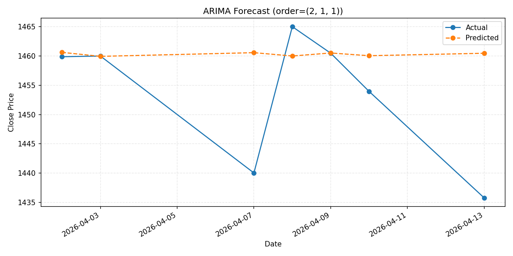
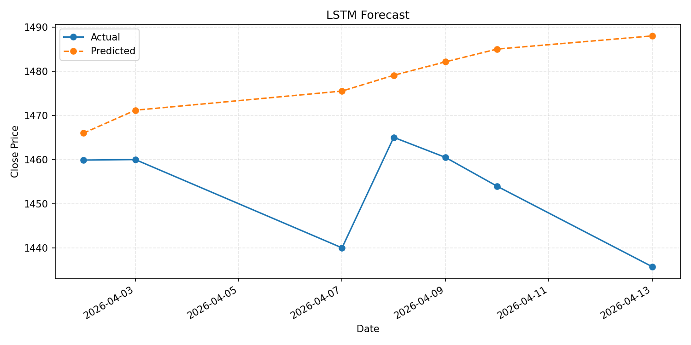
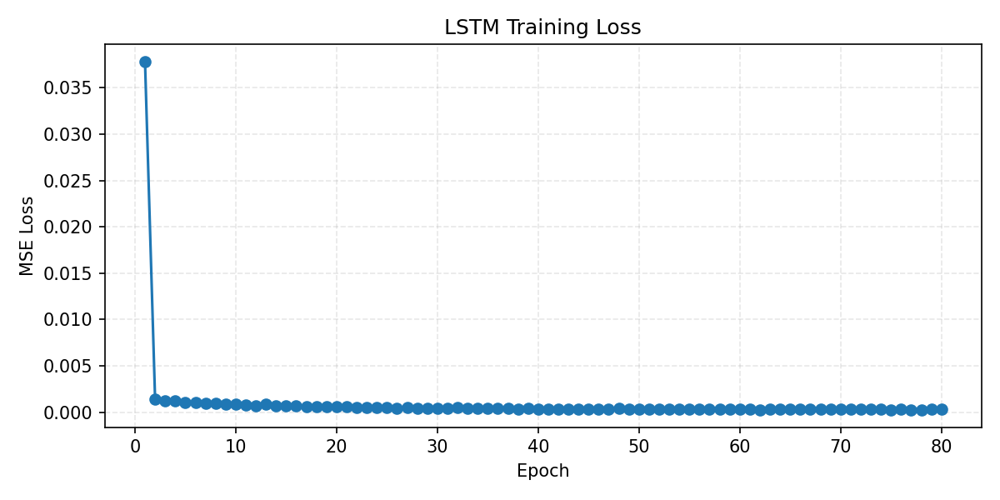

# 大数据课程作业五实验报告

## 实验名称

股票价格预测实验：基于 `ARIMA` 与 `LSTM` 的未来 7 日收盘价预测对比

## 一、实验目的

本实验以贵州茅台（股票代码 `600519`）的历史日线数据为研究对象，分别使用传统时间序列模型 `ARIMA` 和深度学习模型 `LSTM` 对未来 7 个交易日的收盘价进行预测，并通过 `MAE` 与 `RMSE` 指标对两种模型的预测效果进行比较。通过本实验，掌握时间序列数据处理、统计模型建模、循环神经网络建模以及回归任务实验分析的基本流程。

## 二、实验环境

- 操作系统：Windows
- 编程语言：Python
- 主要依赖库：`pandas`、`numpy`、`matplotlib`、`statsmodels`、`scikit-learn`、`torch`
- 数据获取工具：`akshare`
- 项目目录：`D:\SYSU_Bigdata_Assignments\task5`

## 三、数据集与任务说明

本实验使用贵州茅台前复权日线历史数据，股票代码为 `600519`。数据通过 `akshare.stock_zh_a_hist` 接口下载，时间范围为 `2018-01-02` 至 `2026-04-13`，共包含 `2006` 条交易记录。原始数据包含 `日期`、`开盘`、`收盘`、`最高`、`最低`、`成交量`、`成交额` 等字段，本实验选择 `收盘` 作为预测目标，构建单变量时间序列预测任务。

为保证模型比较公平，实验统一采用时间顺序切分数据：

- 训练集：前 `1999` 个交易日
- 测试集：最后 `7` 个交易日
- 预测目标：未来 `7` 个交易日收盘价

这种划分方式符合时间序列预测任务的特点，可以避免随机切分带来的信息泄露问题。

## 四、实验方法与实现过程

### 4.1 数据预处理

首先读取股票 CSV 文件，保留 `日期` 和 `收盘` 两列，并按日期升序排序。检查结果表明，该数据集不存在日期缺失、收盘价缺失和重复日期，因此可以直接用于建模。

随后按时间顺序将最后 `7` 个交易日划为测试集，其余部分作为训练集。对于 `ARIMA` 模型，直接使用原始收盘价序列进行建模；对于 `LSTM` 模型，则仅使用训练集统计量进行最小-最大归一化，以避免测试集信息泄露。

### 4.2 ARIMA 模型

`ARIMA` 是经典的时间序列统计模型，其中：

- `p` 表示自回归项阶数
- `d` 表示差分阶数
- `q` 表示移动平均项阶数

本实验在给定搜索范围内遍历多个 `(p, d, q)` 组合，并使用 `AIC` 作为准则选择最优参数。最终得到的最优模型为 `ARIMA(2, 1, 1)`，对应的 `AIC` 为 `18899.8893`。在得到最优参数后，使用训练集价格序列拟合模型，并一次性预测未来 `7` 个交易日的收盘价。

### 4.3 LSTM 模型

`LSTM` 适合处理序列数据中的长期依赖问题。本实验首先使用滑动窗口将单变量价格序列转换为监督学习样本：以前 `20` 天收盘价作为输入，第 `21` 天收盘价作为标签。随后构建 `LSTM + Linear` 网络进行训练。

本实验的主要超参数如下：

- 窗口长度：`20`
- 隐藏层维度：`64`
- LSTM 层数：`2`
- Dropout：`0.2`
- Batch Size：`16`
- Epochs：`80`
- 学习率：`0.001`

模型训练完成后，以训练集末尾的窗口作为初始输入，采用递归方式逐步预测未来 `7` 个交易日的价格。

### 4.4 评估指标

本实验使用以下两个回归指标评价模型性能：

- `MAE`（Mean Absolute Error）：平均绝对误差，反映预测值与真实值偏差的平均水平
- `RMSE`（Root Mean Squared Error）：均方根误差，对较大误差更敏感

指标值越小，说明模型预测效果越好。

### 4.5 核心代码实现

1. `ARIMA` 模型参数搜索与预测的核心代码如下：

```python
def select_best_order(train_values, max_p: int, max_d: int, max_q: int):
    best_order = None
    best_aic = float("inf")

    for p in range(max_p + 1):
        for d in range(max_d + 1):
            for q in range(max_q + 1):
                order = (p, d, q)
                try:
                    result = ARIMA(train_values, order=order).fit()
                except Exception:
                    continue
                if result.aic < best_aic:
                    best_aic = float(result.aic)
                    best_order = order
    return best_order, best_aic

model = ARIMA(dataset.train_values, order=best_order)
result = model.fit()
forecast = result.forecast(steps=args.forecast_horizon)
metrics = regression_metrics(dataset.test_values, forecast)
```

该部分代码的作用是遍历多个 `(p, d, q)` 组合，使用 `AIC` 选择最优参数，并在最优参数下完成未来 `7` 日预测。

2. `LSTM` 中滑动窗口样本构造与递归预测的核心代码如下：

```python
def build_sequences(series: np.ndarray, window_size: int):
    xs, ys = [], []
    for i in range(len(series) - window_size):
        xs.append(series[i : i + window_size])
        ys.append(series[i + window_size])
    return np.asarray(xs, dtype=np.float32), np.asarray(ys, dtype=np.float32)

def recursive_forecast(model, history, window_size, horizon, device):
    model.eval()
    rolling = history.copy().astype(np.float32)
    preds = []
    with torch.no_grad():
        for _ in range(horizon):
            window = rolling[-window_size:]
            x = torch.tensor(window, dtype=torch.float32, device=device).view(1, window_size, 1)
            next_pred = model(x).item()
            preds.append(next_pred)
            rolling = np.append(rolling, next_pred)
    return np.asarray(preds, dtype=np.float32)
```

上述代码先将单变量价格序列转换为监督学习样本，再利用训练完成的 `LSTM` 模型递归生成未来 `7` 个交易日的预测值。

3. `LSTM` 网络结构与训练过程的核心代码如下：

```python
class StockLSTM(nn.Module):
    def __init__(self, hidden_dim: int, num_layers: int, dropout: float):
        super().__init__()
        self.lstm = nn.LSTM(
            input_size=1,
            hidden_size=hidden_dim,
            num_layers=num_layers,
            dropout=dropout if num_layers > 1 else 0.0,
            batch_first=True,
        )
        self.fc = nn.Linear(hidden_dim, 1)

    def forward(self, x: torch.Tensor) -> torch.Tensor:
        outputs, _ = self.lstm(x)
        last_hidden = outputs[:, -1, :]
        return self.fc(last_hidden).squeeze(-1)

criterion = nn.MSELoss()
optimizer = torch.optim.Adam(model.parameters(), lr=args.lr)

for epoch in range(1, args.epochs + 1):
    model.train()
    for features, targets in train_loader:
        optimizer.zero_grad()
        preds = model(features.to(device))
        loss = criterion(preds, targets.to(device))
        loss.backward()
        optimizer.step()
```

这部分代码展示了 `LSTM` 的网络结构、损失函数和优化过程，是深度学习预测模型的核心实现。

## 五、实验结果

根据实验结果，`ARIMA` 与 `LSTM` 两种模型在测试集上的表现如下表所示：

| 模型 | MAE | RMSE |
| --- | ---: | ---: |
| ARIMA | 8.1732 | 12.5143 |
| LSTM | 24.5199 | 28.7198 |

从结果可以看出，`ARIMA` 在 `MAE` 和 `RMSE` 两项指标上都明显优于 `LSTM`，说明其对本次贵州茅台收盘价序列的短期预测效果更好。

### 5.1 ARIMA 结果

- 最优参数 `(p, d, q)`：`(2, 1, 1)`
- AIC：`18899.8893`
- 训练集大小：`1999`
- 测试集大小：`7`

`ARIMA` 在未来 7 个交易日上的预测值如下：

| 日期 | 真实值 | 预测值 |
| --- | ---: | ---: |
| 2026-04-02 | 1459.88 | 1460.6253 |
| 2026-04-03 | 1460.00 | 1459.9444 |
| 2026-04-07 | 1440.02 | 1460.5754 |
| 2026-04-08 | 1465.02 | 1460.0058 |
| 2026-04-09 | 1460.49 | 1460.5206 |
| 2026-04-10 | 1453.96 | 1460.0553 |
| 2026-04-13 | 1435.76 | 1460.4758 |

<p align="center">
  
</p>

<p align="center"><strong>图 1.</strong> ARIMA 对未来 7 个交易日的预测结果</p>

从图 1 可以看出，`ARIMA` 的预测曲线整体较为平稳，与真实收盘价走势接近，在短期预测中表现出较好的稳定性。

### 5.2 LSTM 结果

- 窗口长度：`20`
- 训练轮数：`80`
- 隐藏层维度：`64`
- LSTM 层数：`2`

`LSTM` 在未来 7 个交易日上的预测值如下：

| 日期 | 真实值 | 预测值 |
| --- | ---: | ---: |
| 2026-04-02 | 1459.88 | 1465.9790 |
| 2026-04-03 | 1460.00 | 1471.1603 |
| 2026-04-07 | 1440.02 | 1475.4915 |
| 2026-04-08 | 1465.02 | 1479.0651 |
| 2026-04-09 | 1460.49 | 1482.1033 |
| 2026-04-10 | 1453.96 | 1484.9996 |
| 2026-04-13 | 1435.76 | 1487.9708 |

<p align="center">
  
</p>

<p align="center"><strong>图 2.</strong> LSTM 对未来 7 个交易日的预测结果</p>

<p align="center">
  
</p>

<p align="center"><strong>图 3.</strong> LSTM 训练损失曲线</p>

从图 2 可以看出，`LSTM` 的预测值整体呈连续上升趋势，后几天与真实价格偏离较为明显。图 3 显示训练损失持续下降，说明模型能够拟合训练集，但泛化效果仍然有限。

## 六、结果分析

从本次实验结果来看，`ARIMA` 模型的预测误差明显小于 `LSTM`，说明在当前实验设置下，传统统计时间序列模型比深度学习模型更适合该任务。

首先，本实验采用的是单变量时间序列预测，只使用了历史收盘价作为输入特征，没有加入成交量、开盘价、最高价、最低价等额外信息。在这种信息较少的情况下，`ARIMA` 能够较好地利用价格序列的自相关性和差分后的线性结构，因此在短期预测中往往表现较稳定。此次最优参数中 `d=1`，也说明原始价格序列需要通过一阶差分来减弱非平稳性。

其次，虽然 `LSTM` 具备建模非线性时序关系的能力，但其性能对窗口长度、隐藏层维度、训练轮数、学习率等超参数较为敏感。当前实验中使用的是较基础的单变量滑动窗口建模方式，模型结构和输入特征都相对简单，因此未能充分发挥深度学习模型的优势。

此外，本实验中的 `LSTM` 采用递归方式连续预测未来 `7` 个交易日，即后一天的预测结果会参与下一天的预测输入。这种方式虽然符合多步预测的常见做法，但也会导致误差逐步累积。从预测结果可以看出，`LSTM` 的预测值整体呈持续上升趋势，并逐渐偏离真实价格，而 `ARIMA` 的预测值则更加平稳，整体更接近真实收盘价水平。

综合来看，本实验表明：对于样本规模适中、仅包含单一价格特征的股票短期预测任务，`ARIMA` 这类传统时间序列方法依然具有较强的竞争力；而 `LSTM` 若想取得更好的效果，通常需要更丰富的输入特征、更充分的参数调优以及更合理的预测策略。

## 七、实验总结

本实验完成了贵州茅台历史股价数据的获取、时间序列建模、未来 `7` 日收盘价预测以及模型效果对比。实验结果表明，在当前数据集和参数设置下，`ARIMA(2, 1, 1)` 的表现显著优于 `LSTM`，其 `MAE` 和 `RMSE` 均更低，说明传统统计模型在该单变量短期预测任务中具有更高的稳定性。

通过本实验可以看出，传统时间序列模型与深度学习模型各有优势：前者结构清晰、训练稳定、适合较强自相关的单变量序列；后者表达能力更强，但对数据规模、输入特征和参数配置更加敏感。

后续可以从以下方向继续改进：

1. 尝试更多股票和更长时间区间，比较结论是否稳定。
2. 引入成交量、开盘价、最高价、最低价等多维特征，构建多变量预测模型。
3. 对 `LSTM` 的窗口大小、层数、隐藏维度、训练轮数进行系统调参。
4. 引入 `GRU`、`Transformer` 等模型进一步对比。

## 八、附录

本实验涉及的主要代码与结果文件如下：

| 文件 | 作用 |
| --- | --- |
| `train_arima.py` | 完成 `ARIMA` 参数搜索、训练、预测与指标保存 |
| `train_lstm.py` | 完成 `LSTM` 数据构造、模型训练、递归预测与结果保存 |
| `src/data.py` | 负责股票数据读取、训练测试划分与归一化处理 |
| `src/evaluate.py` | 负责 `MAE`、`RMSE` 计算与预测图绘制 |
| `outputs/metrics/arima_metrics.json` | 保存 `ARIMA` 的评估指标与最优参数 |
| `outputs/metrics/lstm_metrics.json` | 保存 `LSTM` 的评估指标与训练参数 |
| `outputs/forecasts/arima_forecast.csv` | 保存 `ARIMA` 预测值与真实值 |
| `outputs/forecasts/lstm_forecast.csv` | 保存 `LSTM` 预测值与真实值 |
| `outputs/figures/arima_forecast.png` | `ARIMA` 预测图 |
| `outputs/figures/lstm_forecast.png` | `LSTM` 预测图 |
| `outputs/figures/lstm_training_curve.png` | `LSTM` 训练损失曲线图 |
