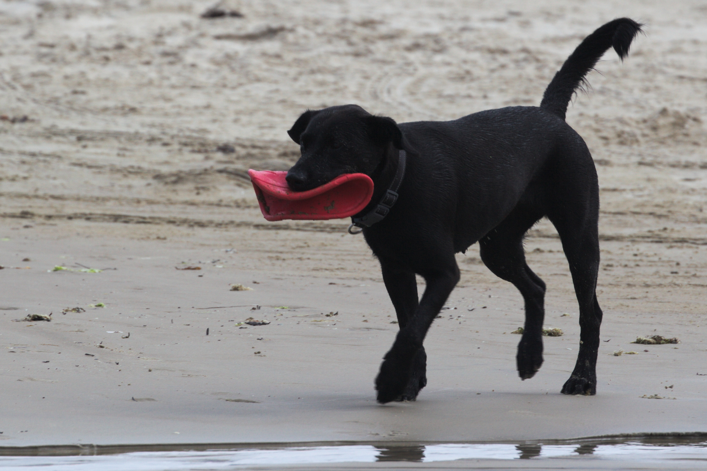
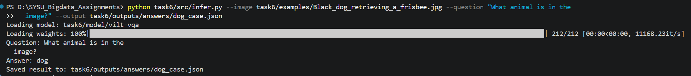
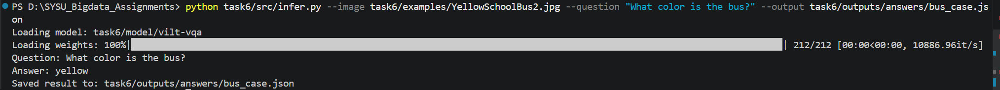

# 实验报告：图文多模态问答（VQA）

## 1. 实验目的

本实验的目标是调用 Hugging Face 提供的 ViLT 预训练模型，完成“输入图片和自然语言问题，输出文本答案”的视觉问答任务。通过本次作业，掌握多模态模型的基本调用流程，并结合具体测试样例分析模型输出结果。

## 2. 实验环境

- 操作系统：Windows
- 编程语言：Python 3
- 深度学习框架：PyTorch
- 主要依赖库：transformers、Pillow、requests
- 使用模型：`dandelin/vilt-b32-finetuned-vqa`
- 本地模型目录：`task6/model/vilt-vqa/`

## 3. 实验原理与方法

ViLT（Vision-and-Language Transformer）是一种视觉语言预训练模型，可以同时处理图像和文本输入。与传统方法相比，ViLT 不依赖较复杂的区域特征提取流程，而是直接对图像 patch 和文本 token 进行联合建模，因此适合快速完成图文问答任务。

本实验的实现流程如下：

1. 读取输入图片。
2. 输入自然语言问题。
3. 使用 `ViltProcessor` 对图片和文本进行预处理。
4. 使用 `ViltForQuestionAnswering` 进行前向推理。
5. 对输出结果取最大概率对应的标签。
6. 输出答案，并保存为 JSON 文件。

核心脚本为：

- `task6/src/infer.py`

## 4. 实验内容与实现

本实验将模型文件保存到本地目录 `task6/model/vilt-vqa/`，避免重复从网络下载。推理脚本 `infer.py` 支持输入图片路径、输入问题、调用本地 ViLT 模型并输出答案，同时将结果保存到 `task6/outputs/answers/` 目录下。

脚本具备以下功能：

- 支持本地图片输入
- 支持英文问题输入
- 自动加载本地模型目录
- 将预测结果保存为 JSON 文件

## 5. 关键代码

本实验只保留核心推理代码，不展示完整脚本。核心代码如下：

```python
device = torch.device("cuda" if torch.cuda.is_available() else "cpu")
model_source = args.model_name
if args.model_name == DEFAULT_LOCAL_MODEL and not Path(DEFAULT_LOCAL_MODEL).exists():
    model_source = DEFAULT_REMOTE_MODEL

processor = ViltProcessor.from_pretrained(model_source)
model = ViltForQuestionAnswering.from_pretrained(
    model_source,
    use_safetensors=True,
).to(device)
model.eval()

image = load_image(args.image)
encoding = processor(image, args.question, return_tensors="pt")
encoding = {key: value.to(device) for key, value in encoding.items()}

with torch.no_grad():
    outputs = model(**encoding)
    logits = outputs.logits
    predicted_idx = int(logits.argmax(-1).item())
    answer = model.config.id2label[predicted_idx]
```

这段代码对应了本次实验最关键的步骤，包括模型加载、图文联合编码、前向推理和答案解码。

## 6. 测试样例与结果

本次实验最终选择两张公开图片进行测试，不再使用之前的临时测试图。

### 6.1 测试样例一：黑狗叼飞盘

图片文件：

- `task6/examples/Black_dog_retrieving_a_frisbee.jpg`

输入问题：

- `What animal is in the image?`

模型输出：

- `dog`

结果文件：

- `task6/outputs/answers/dog_case.json`

建议在此处插入两张图：

- 图 1：测试图片 `Black_dog_retrieving_a_frisbee.jpg`
- 图 2：该案例的终端运行截图

图 1 如下：



图 2 如下：



结果分析：

该图片主体非常清晰，图中主要目标是一只黑色的狗，模型成功识别出了图片中的主要动物类别，输出结果与图像内容一致，说明 ViLT 在目标突出、语义简单的识别类问题上效果较好。

### 6.2 测试样例二：黄色校车

图片文件：

- `task6/examples/YellowSchoolBus2.jpg`

输入问题：

- `What color is the bus?`

模型输出：

- `yellow`

结果文件：

- `task6/outputs/answers/bus_case.json`

建议在此处插入两张图：

- 图 3：测试图片 `YellowSchoolBus2.jpg`
- 图 4：该案例的终端运行截图

图 3 如下：


图 4 如下：



结果分析：

该图片中校车占据了主要画面区域，颜色特征明显，模型输出 `yellow`，与图像真实内容一致，说明 ViLT 对突出物体的颜色属性识别也有较好的表现。

## 7. 运行命令

### 7.1 黑狗案例

```bash
python task6/src/infer.py --image task6/examples/Black_dog_retrieving_a_frisbee.jpg --question "What animal is in the image?" --output task6/outputs/answers/dog_case.json
```

### 7.2 校车案例

```bash
python task6/src/infer.py --image task6/examples/YellowSchoolBus2.jpg --question "What color is the bus?" --output task6/outputs/answers/bus_case.json
```

## 8. 实验结果汇总

| 测试图片 | 问题 | 模型答案 | 是否符合预期 |
| --- | --- | --- | --- |
| `Black_dog_retrieving_a_frisbee.jpg` | `What animal is in the image?` | `dog` | 是 |
| `YellowSchoolBus2.jpg` | `What color is the bus?` | `yellow` | 是 |

从本次测试结果可以看出，ViLT 模型在这两个基础 VQA 案例上都给出了正确答案，能够满足作业对“输入图片 + 问题，输出答案”的基本要求。

## 9. 结果分析

本次实验的两个测试案例分别对应目标识别和颜色识别，两类问题都属于语义较直接、目标较明显的视觉问答任务。从输出结果来看，模型均得到了正确答案，说明预训练 ViLT 模型具备较好的通用图文理解能力。

不过，本次实验样例数量较少，问题也相对简单，因此还不能说明模型在复杂推理、细粒度关系判断或计数问题上同样稳定。若继续扩展实验，可以增加更多图片，并尝试位置关系、数量统计和属性组合等更复杂的问题。

## 10. 实验总结

通过本次实验，我掌握了如何调用 Hugging Face 的预训练 ViLT 模型完成视觉问答任务，理解了图像与文本联合输入、多模态编码和答案预测的基本流程。实验结果表明，在图片主体清晰、问题表述直接的情况下，ViLT 能够给出较准确的答案。

对于本次课程作业而言，当前实验已经完成了模型调用、样例测试、结果输出和报告整理等核心要求，具备提交基础。
